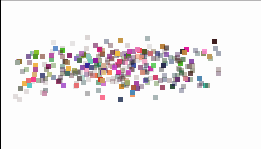

# pixel-swiper
> pixel picture or text effect by canvas

[DEMO online](http://output.jsbin.com/zizogesupi/)



# Browser
 ```html
 <script src="yourStaticPath/pixelSwiper.js"></script>
```

# Default import
```
npm install pixel-swiper
```

```js
import pixelSwiper from 'pixel-swiper';
```

# Usage
```js
const swiper   = new pixelSwiper('#c', {
      width: 250,
      height: 100,
      particleSize: 4,
      animation: true,
      randomPosition: true,
      velocity: 5,
      shape: 'square',
      swipeList: [
        {
          paddingTop: 10,
          url: 'data:image/jpeg;base64,/9j/4AAQSkZJRgABAQEASABIAAD/2wBDAAgGBgcGBQgHBwcJCQgKDBQNDAsLDBkSEw8UHRofHh0aHBwgJC4nICIsIxwcKDcpLDAxNDQ0Hyc5PTgyPC4zNDL/2wBDAQkJCQwLDBgNDRgyIRwhMjIyMjIyMjIyMjIyMjIyMjIyMjIyMjIyMjIyMjIyMjIyMjIyMjIyMjIyMjIyMjIyMjL/wAARCAA8ADwDASIAAhEBAxEB/8QAGgAAAgMBAQAAAAAAAAAAAAAABQYDBAcCAf/EADcQAAEDAgUDAwMCAQ0AAAAAAAECAwQFEQASITFBBhNhFFFxIoGhMpEzFSM0Q1JicrHB0eHw8f/EABgBAAMBAQAAAAAAAAAAAAAAAAIEBQMB/8QALREAAQMCAwQLAQEAAAAAAAAAAQIDEQAEEiExBSJBURMUYXGBobHB0fDxMkL/2gAMAwEAAhEDEQA/ALacSpvjhI0xXTKlF8pbgOPtZC4FNH6rA2P0nf7YvPXDbMdIYmobFq6+FFpM4da7nANJEixIAKFj3B1HxqBrgL3FdP1Fc4kOQnW8q0Jsj6r7pHJ41864YY02NIjd5C8zZuMttb8i3vgfHdEhbsKUzeIW1JUs2zN5NvnMCRb3xGvyGnkvtKEn7PjVG0SpTamXUnL7HhRxC0OMIduAhaQoZvO2BxoFGfW6ow2FrcJK1DfXf42wvumbQZSG3IshynFkhoKWXe1/f9gfg4hhS5T/AHo1IdUUOAFbq0BPbHN/9tzgztJpRlaMudCjZizOFX5V+qqgKqoi0ynMzKtmzlar5GTp9Sj400/8x6rouPKUXqhNkSJSzdbgOQE+BwMDlVSR02wlqJSS4FKUtx5ei3ABoT5/HFhgHI6trNTc9Qw41ERbL2+/l1B3tf8A7bBBy3dGJYk8hoPnvoVNutnC1kOfE/A7B4zWjBJUhSRuQRj1+uQIVGp7yn0xpsRRAzD9YNybe/x5OPAxMkBJitKLZ0zDQk+L7DzhVrNVZoM5ClJbckN6JSkgqQoX2UPa5vb35wvtB9Ny6G2cyJny96pbHQm3ZU48oDERAzniDIA0IP5XUZyU/wBQiP2vTiU/lW2RayTqT+T+xxN1D1PGplaVBpkQSHEkIUj+1qDlPta22w51vjuNJjOQHq3UAYTnaXlZkKyh5Nv1JXyq9xpqMJUGQ9U5ct2n04RvULOV25IQOQL/ACDpiey1jXOGTpHbT904glKVL3Rxj09M6dDUm3KSYuVT7XqFLdid4XSMoJCdbkc2+cDmJJo8tEiE44umLeQHUqsb7FQA3JA0vjQaX030v1P0szLapMNMoIyuGMkJcQ4BZQvvfS+vvhXdoUakS1mMJb6UOJS4Ui62wo5bJsLgnUlR1AHm+OLhAhVLJQHVbmQ9qKrl9L1buNRZhbcQP4DqVAn4B1v8YUVSWqG4qK3Dp6cxLiruKJJPJuNDpsNMaLBfpdLR6d5uI0w4g2aWE6KtodefOM66goyWqu4WH7IWAsJyFWW/F764Wt3koGRMHnWy7Rf+c6N1zq6VDZVHaWkPrTlsjTtjk/PGM+bbbqvVsOJPfDLLq221unYDn9zp98WbOvOKW4blRzEqO3nECaM7WKkBHQ++0E6oSnU23N9gnycO25DAITqaU6IqHSHQVpPVr1IjURdGkNJQwBowPqWyrjt34G/j8YTKlOCBR2aXELX82pbEdtOYpBNtfe9ifviN9EJ+pGNLTIbcbT23HW3g6lSx+oknj49sRPViQ66puK5Hi/WQ0Qgh5CAgJspXKSCRYY60EtYSCSda0Uhb0yN2u2pLlKmstZj6jMA+ELJsr9R2HGlxrzhpROah1JlFAlsv+pQ0z2E7KUbpDh50JF/kYr9GU308KTVSwVuoJSym9ypfKr+bgfvh1NAXR+nEy1tJ/lJUtiQ8sJByBKwSNOLXv/xhZwh1ZB0GveabbwspHM17I6QcpzCX47bM13JeQp5GZxSuSL7jwPzhZn9HVKRLU561mmAj+jZCvL502v7cYfXFzXIap0WsNOQVpKm87YWALbFQNzr84SOpIfUFQqDUhvO4S0AooWlABzK0t8WwJQhJmc6HrTpTBz9az1IS6kNo0a3tyu3Pxh76XbYqTy20sLZpUNtK3UKVm77pOmc87aDYDF5uhU5xxZ9OE/1dk6DKmxt9zv74lWhNH6LgCGMhkIDzhOpUtV7n86fAw7f2xtkAzJNT7a8604UgQBSp1KwiTU3FwYaLoUS66hAGZZ3GnA8c4UXm30P98JBfWQ2y2g3zLOgH5w8qASysDQZT/lhDYfcV1FEJVfsvBSBwCFaYwa07qrLxNoDSTkT51s1KpyIUal0xaiVNlIccIGp3UbnS9740Pb7YVaWyh2ttrXcltJKRwD7/ADhpOMLfNuTxk0rcnfjlS7VoTaH3FtghSxmACjbMNjba/nECScozD6ra/OCVW/jN/wCH/XA074zX/ZFCnSv/2Q==',
          duration: 3000,
        },
        {
          text: 'pixel',
          paddingLeft: 5,
          fontSize: 80,
          color: '#F56C6C',
          duration: 3000,
        },
        {
          text: 'swiper',
          fontSize: 80,
          randomParticleColor: true,
          duration: 3000,
        },
      ]
});
```

# Options
| Names | Defaults | Description
| --- | --- | ---
| width | `0` | canvas width
| height | `0` | canvas height
| particleSize | `20` | particle size
| animation | `true` | `true` - use animation
| randomPosition | `false` | `true` - use random position
| velocity | `1` | particle animate velocity
| shape | `square` | particle shape, `square` or `round`
| swipeList | `[]` | swipe config 


# swipeList Options
| Names | Defaults | Description
| --- | --- | ---
| paddingLeft | `0` | canvas paddingLeft
| paddingTop | `0` | canvas paddingTop
| text | `''` | render text
| fontSize | `12` | text font size
| color | `''` | text color
| duration | `0`  | swipe duration, millisecond
| randomParticleColor | `false` | `true` - use random color
| url | `''` | image url